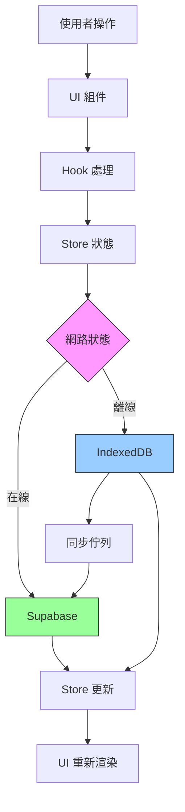

# Venturo 系統架構文件

> 版本：1.0
> 最後更新：2025-10-26
> 狀態：正式文件

---

## 🎯 專案概述

**Venturo** 是一個專為小型旅行社設計的旅遊團管理系統，採用離線優先架構，支援團體管理、訂單處理、工作區協作、財務追蹤等功能。

### 核心技術棧

```
前端框架:    Next.js 15.5.4 (App Router)
UI 框架:     React 19
類型系統:    TypeScript 5
狀態管理:    Zustand 5
UI 組件:     Radix UI + TailwindCSS
後端服務:    Supabase
本地資料庫:  IndexedDB
設計風格:    莫蘭迪色系 + 液態玻璃效果
```

### 專案規模

```
總代碼量:     86,068 行
檔案總數:     489 個 TypeScript/React 檔案
專案大小:     2.8 MB
頁面路由:     51 個頁面
開發端口:     3000
```

---

## 🏗️ 架構設計

### 架構模式：Hybrid Feature-Based + Layer-Based

我們採用混合式架構，結合了功能模組化和分層設計的優點：

```
venturo-new/
├── src/
│   ├── features/           # 功能模組（Feature-Based）
│   │   ├── dashboard/     # 儀表板功能
│   │   │   ├── components/
│   │   │   └── hooks/
│   │   └── tours/         # 旅遊團功能
│   │       ├── components/
│   │       ├── services/
│   │       └── hooks/
│   │
│   ├── app/               # Next.js 頁面路由（Layer-Based）
│   ├── components/        # 共享組件（Layer-Based）
│   ├── stores/            # 狀態管理（Layer-Based）
│   ├── hooks/             # 共享 Hooks（Layer-Based）
│   ├── lib/               # 工具函數（Layer-Based）
│   ├── services/          # API 服務（Layer-Based）
│   └── types/             # 型別定義（Layer-Based）
```

### 設計哲學：公司組織譬喻

把專案想像成一家旅行社公司的組織結構：

```
🏢 Venturo 旅行社總部

├── 🏛️ 核心管理層（lib/）
│   ├── 📋 制度規範（types/）         - 公司規章、表格格式
│   ├── 👔 部門經理（services/）      - 標準作業流程
│   └── ⚠️ 風控部門（errors/）       - 錯誤處理機制
│
├── 🏭 業務部門（features/）
│   ├── ✈️ 旅遊團部（tours/）
│   │   ├── 📊 業務邏輯（services/）
│   │   ├── 👥 業務員（hooks/）
│   │   └── 📝 表單組件（components/）
│   └── 💰 財務部（finance/）
│
├── 🏪 營業大廳（app/）
│   ├── 🎯 首頁接待（page.tsx）
│   ├── 🗺️ 旅遊團櫃台（tours/）
│   ├── 📝 訂單櫃台（orders/）
│   └── 💰 財務中心（finance/）
│
├── 🎨 裝潢設計（components/）
│   ├── 🖼️ 大廳佈置（layout/）
│   ├── 🪟 櫃台窗口（ui/）
│   └── 📋 表單模板（domain components）
│
└── 🗄️ 資料倉庫（stores/）
    ├── 📁 旅遊團檔案（tour-store.ts）
    ├── 📁 訂單檔案（order-store.ts）
    └── 📁 工作區檔案（workspace/）
```

---

## 📊 資料流架構

### 同步機制總覽

Venturo 採用**兩種不同的同步機制**，針對不同功能需求：

| 功能類型 | 同步機制 | 適用功能 | 特點 |
|---------|---------|---------|------|
| **主要功能** | Offline-First | Tours, Orders, Finance 等 | 離線可用、快速載入 |
| **即時協作** | Realtime (規劃中) | Workspace Chat | 即時推送、多人協作 |

---

### 1. 離線優先（Offline-First）架構

**適用**: 所有主要業務功能 (Tours, Orders, Employees, Finance 等)



#### 資料流說明

1. **使用者操作** → UI 組件接收輸入
2. **Hook 處理** → 處理業務邏輯、驗證
3. **Store 更新** → Zustand 更新應用狀態
4. **雙向儲存**:
   - **IndexedDB 優先**: 立即寫入本地 (0.1 秒)
   - **Supabase 背景同步**: setTimeout 背景更新雲端
5. **離線支援**:
   - 離線時資料存入 IndexedDB + 同步佇列
   - 恢復在線時自動從佇列同步
6. **UI 更新** → React 重新渲染相關組件

#### 實作範例

```typescript
// src/stores/utils/sync-helper.ts
export async function loadWithSync<T>(options: SyncOptions<T>) {
  // 1️⃣ 從 IndexedDB 快速載入 (0.1 秒)
  const cached = await localDB.getAll(tableName);

  // 2️⃣ 背景從 Supabase 同步
  setTimeout(async () => {
    const { data } = await supabase.from(tableName).select('*');
    // 更新 IndexedDB 和 Store
  }, 0);

  return { cached, fresh: null };
}
```

---

### 2. Workspace 同步機制（特殊）

**適用**: Workspace Chat（工作空間聊天）

#### 目前狀態

```typescript
// src/stores/workspace/chat-store.ts (目前實作)
loadMessages: async (channelId) => {
  // ✅ 步驟 1: IndexedDB 快速載入
  const cached = await localDB.getAll('messages');

  // ✅ 步驟 2: 背景同步
  setTimeout(async () => {
    const { data } = await supabase.from('messages').select('*');
    // 更新本地
  }, 0);
}
```

**特點**:
- ✅ 離線可看歷史訊息
- ✅ 快速載入
- ❌ 不即時（需手動刷新才能看到其他人的新訊息）

---

#### 未來規劃: 加入 Realtime

```typescript
// 未來實作 (規劃中)
subscribeToChannel: (channelId: string) => {
  // ⚡ 訂閱 Realtime 推送
  const channel = supabase
    .channel(`chat:${channelId}`)
    .on('postgres_changes', {
      event: 'INSERT',
      schema: 'public',
      table: 'messages',
      filter: `channel_id=eq.${channelId}`
    }, (payload) => {
      // 🎯 其他人發訊息時，立即推送到本機
      addMessage(payload.new);
      localDB.put('messages', payload.new); // 同時存入 IndexedDB
    })
    .subscribe();

  return () => channel.unsubscribe();
}
```

**加入 Realtime 後的特點**:
- ✅ 離線可看歷史訊息（IndexedDB）
- ✅ 快速載入（IndexedDB）
- ✅ 即時接收新訊息（Realtime Push）
- ✅ 多人協作體驗（像 Slack）
- ⚠️ 需保持頁面開啟（連線才有效）

---

### 3. 兩種機制的差異

#### Offline-First (Pull 拉取模式)

```
用戶打開頁面
    ↓
從 IndexedDB 立即載入 (0.1 秒)
    ↓
背景從 Supabase 同步
    ↓
需要手動刷新才能看到其他人的更新
```

**優點**:
- ✅ 離線完全可用
- ✅ 超快載入速度
- ✅ 節省連線數

**缺點**:
- ❌ 不即時
- ❌ 需手動刷新

**適用**: 大部分功能（Tours, Orders, Finance 等）

---

#### Realtime (Push 推送模式)

```
用戶打開 Chat 頁面
    ↓
從 IndexedDB 立即載入歷史訊息
    ↓
訂閱 Realtime 連線
    ↓
其他人發訊息 → Supabase 自動推送
    ↓
立即顯示新訊息（不用刷新）
```

**優點**:
- ✅ 即時協作
- ✅ 自動推送
- ✅ 仍保有 IndexedDB 離線查看歷史

**缺點**:
- ⚠️ 需保持連線（離開頁面自動斷線）
- ⚠️ 佔用連線數（Free tier: 200 連線）

**適用**: Workspace Chat（需要即時協作的功能）

---

### 4. 為什麼不全部用 Realtime？

#### 原因 1: 大部分功能不需要即時性

```
❌ Tours（旅遊團）
  - 編輯團資訊過 5 分鐘同步 → 完全可接受
  - 離線可用更重要

❌ Orders（訂單）
  - 新增訂單不需要立即通知所有人
  - 穩定性優先

✅ Chat（聊天）
  - 需要立即看到訊息 → 需要 Realtime
  - 就像 Line、Slack
```

#### 原因 2: 連線數考量

```
如果所有功能都用 Realtime:
- Tours 頁面: 10 連線
- Orders 頁面: 10 連線
- Finance 頁面: 10 連線
- Chat 頁面: 10 連線
= 用戶開多個分頁就容易超過 200 連線限制

只有 Chat 用 Realtime:
- Chat 頁面: 10 連線
- 其他用 Offline-First
= 200 連線可支援更多用戶
```

#### 原因 3: Offline-First 體驗更好

```
Offline-First:
- 開啟頁面 → 0.1 秒載入 ← 超快！
- 網路斷線 → 仍可使用 ← 穩定！

全部 Realtime:
- 開啟頁面 → 等待連線 0.5-1 秒
- 網路斷線 → 無法使用 ← 不穩定
```

---

### 5. 最佳實踐：混合架構

| 功能 | 同步機制 | 原因 |
|------|---------|------|
| Tours | Offline-First | 離線可用、快速載入 |
| Orders | Offline-First | 不需即時、穩定優先 |
| Employees | Offline-First | 更新頻率低 |
| Finance | Offline-First | 穩定性優先 |
| Accounting | Offline-First | 資料準確性優先 |
| **Workspace Chat** | **Offline-First + Realtime** | 離線看歷史 + 即時新訊息 |
| Notifications | Realtime (未來) | 需即時推送 |

---

## 🗂️ 核心目錄結構

### /app - 頁面路由

```
app/
├── page.tsx                    # 首頁儀表板
├── tours/                      # 旅遊團管理 (2 pages)
├── orders/                     # 訂單管理 (6 pages)
├── quotes/                     # 報價單 (2 pages)
├── finance/                    # 財務模組 (7 pages)
├── contracts/                  # 合約管理 (2 pages)
├── customers/                  # 客戶管理 (1 page)
├── visas/                      # 簽證管理 (1 page)
├── workspace/                  # 工作區協作 (1 page)
├── database/                   # 資料庫管理 (6 pages)
├── hr/                         # 人資管理 (1 page)
├── todos/                      # 待辦事項 (1 page)
├── calendar/                   # 行事曆 (1 page)
├── settings/                   # 設定 (1 page)
└── api/                        # API Routes (4 routes)
```

**總計**: 51 個頁面路由

### /components - React 組件

```
components/
├── ui/                         # 基礎 UI 組件 (34 個)
│   ├── button.tsx
│   ├── dialog.tsx
│   ├── table.tsx
│   └── enhanced-table.tsx
│
├── layout/                     # 版面組件
│   ├── main-layout.tsx
│   ├── sidebar.tsx
│   └── header.tsx
│
├── table-cells/                # 表格單元格組件 (8 個)
│   ├── date-cell.tsx
│   ├── status-cell.tsx
│   └── currency-cell.tsx
│
├── tours/                      # 旅遊團組件
│   ├── TourPage.tsx            (897 lines - 需拆分)
│   ├── tour-costs.tsx
│   └── tour-payments.tsx
│
├── workspace/                  # 工作區組件
│   ├── ChannelChat.tsx
│   ├── ChannelSidebar.tsx      (833 lines - 需拆分)
│   └── MessageList.tsx
│
└── todos/                      # 待辦事項組件
    └── todo-expanded-view.tsx  (777 lines - 需拆分)
```

**代碼分布**: 185 個檔案，1.6MB (57% 專案代碼)

### /stores - 狀態管理

```
stores/
├── core/                       # Store 核心架構
│   ├── create-store-new.ts    # Store Factory (新版)
│   └── base-store.ts           # 基礎 Store 邏輯
│
├── workspace/                  # 工作區 Stores
│   ├── channels-store.ts
│   ├── messages-store.ts
│   ├── members-store.ts
│   └── index.ts                # Facade Pattern (需解耦)
│
├── tour-store.ts               # 旅遊團狀態
├── order-store.ts              # 訂單狀態
├── customer-store.ts           # 客戶狀態
├── payment-store.ts            # 付款狀態
├── quote-store.ts              # 報價單狀態
├── user-store.ts               # 員工狀態
└── types.ts                    # Store 型別定義
```

**Store Factory Pattern**:

```typescript
// 所有 stores 使用統一工廠建立
export const useTourStore = createStoreNew<Tour>('tours', 'T');

// 自動提供 CRUD 方法
const { items, loading, create, update, delete, fetchAll } = useTourStore();
```

### /features - 功能模組

```
features/
└── dashboard/                  # 儀表板功能
    ├── components/
    │   ├── calculator-widget.tsx
    │   ├── currency-widget.tsx
    │   ├── timer-widget.tsx
    │   ├── notes-widget.tsx
    │   ├── weather-widget.tsx
    │   └── manifestation-widget.tsx
    ├── hooks/
    │   └── use-dashboard.ts
    └── index.ts
```

**未來擴展**:
- `features/tours/` - 旅遊團功能模組
- `features/orders/` - 訂單功能模組
- `features/workspace/` - 工作區功能模組

### /hooks - React Hooks

```
hooks/
├── useListPageState.ts         (275 lines - 保留)
├── useDataFiltering.ts         (259 lines - 保留)
├── useTours.ts                 (395 lines - 需拆分)
├── useOrders.ts
├── usePayments.ts
├── useQuotes.ts
└── use-auto-create-tour-channels.ts
```

**Hook 分類**:
- **資料管理**: useTours, useOrders, useCustomers
- **UI 狀態**: useListPageState, useDialogState
- **業務邏輯**: useDataFiltering, usePaymentTracking
- **自動化**: use-auto-create-tour-channels

### /services - API 服務層

```
services/
├── storage/
│   └── index.ts                # 檔案上傳服務
├── payment-requests.ts
├── supabase.ts
├── workspace-channels.ts
└── workspace-members.ts
```

**問題**: Service Layer 太薄弱，只有 5 個服務

**建議擴展**:
- TourService
- OrderService
- PaymentService
- QuoteService
- CustomerService
- VisaService
- ContractService
- EmployeeService

### /lib - 工具函數

```
lib/
├── utils/
│   ├── logger.ts               # 統一日誌系統
│   ├── uuid.ts                 # UUID 生成
│   └── cn.ts                   # className 工具
│
├── db/
│   ├── local-db.ts             # IndexedDB 封裝
│   ├── schemas.ts              # Schema 定義
│   └── database-initializer.ts
│
├── supabase/
│   └── client.ts               # Supabase Client
│
├── permissions.ts              # 權限系統
└── contract-utils.ts           # 合約工具
```

---

## 🔄 狀態管理架構

### Zustand Store 模式

```typescript
// 1. 定義型別
interface Tour extends BaseEntity {
  id: string;
  code: string;
  name: string;
  start_date: string;
  end_date: string;
  max_people: number;
  current_people: number;
  status: 'planning' | 'confirmed' | 'ongoing' | 'completed';
  created_at: string;
  updated_at: string;
}

// 2. 使用 Factory 建立 Store
export const useTourStore = createStoreNew<Tour>('tours', 'T');

// 3. 在組件中使用
function TourList() {
  const { items, loading, error, create, update, delete: deleteTour } = useTourStore();

  return (
    <div>
      {items.map(tour => (
        <TourCard key={tour.id} tour={tour} />
      ))}
    </div>
  );
}
```

### Store 依賴關係

```
核心 Stores (無依賴):
├── tourStore
├── orderStore
├── customerStore
└── employeeStore

依賴型 Stores:
├── paymentStore → orderStore, tourStore
├── memberStore → orderStore
├── quoteStore → tourStore
└── contractStore → tourStore

Workspace Stores (高耦合 - 需解耦):
└── useWorkspaceStore → 5 個 stores
    ├── channelsStore
    ├── messagesStore
    ├── membersStore
    ├── channelMembersStore
    └── workspaceStore
```

---

## 🎨 UI 組件系統

### 組件層次結構

```
深度 1 - 基礎組件 (Atomic):
├── Button
├── Input
├── Dialog
├── Table
└── Card

深度 2 - 複合組件 (Molecular):
├── EnhancedTable (使用 Table + 分頁 + 搜尋)
├── ResponsiveHeader (使用 Header + Button)
└── ListPageLayout (使用 Card + Table + Header)

深度 3 - 頁面組件 (Organism):
├── TourPage (使用 ListPageLayout + TourCard)
├── OrderPage (使用 EnhancedTable + OrderForm)
└── DashboardPage (使用多個 Widget)
```

### Table Cell 組件系統

Phase 1 建立的可重用表格單元格組件：

```typescript
// 8 個專用 Cell 組件
<DateCell value={tour.start_date} format="yyyy-MM-dd" />
<StatusCell status={order.status} type="order" />
<CurrencyCell amount={payment.amount} currency="TWD" />
<ActionCell onEdit={...} onDelete={...} onView={...} />
<NumberCell value={tour.current_people} max={tour.max_people} />
<TextCell value={customer.name} truncate={true} />
<LinkCell href={`/tours/${tour.id}`} label={tour.code} />
<BadgeCell items={tour.tags} />
```

---

## 🗄️ 資料模型

### 核心實體 (Entity)

```typescript
// 主要業務實體
Tour          // 旅遊團
Order         // 訂單
Member        // 團員（旅客）
Customer      // 客戶
Payment       // 付款記錄
Quote         // 報價單
Contract      // 合約
Visa          // 簽證
Employee      // 員工
Todo          // 待辦事項

// 工作區實體
Workspace     // 工作區
Channel       // 頻道
Message       // 訊息
ChannelMember // 頻道成員
```

### 關聯關係

```
Tour (旅遊團)
  └── 1:N → Order (訂單)
       ├── 1:N → Member (團員)
       ├── 1:N → Payment (付款)
       └── N:1 → Customer (客戶)

Tour (旅遊團)
  ├── 1:1 → Contract (合約)
  ├── 1:N → Quote (報價單)
  └── 1:N → Channel (工作區頻道)

Order (訂單)
  └── 1:N → Visa (簽證)
```

### BaseEntity 標準

所有實體都繼承 BaseEntity：

```typescript
interface BaseEntity {
  id: string;              // UUID
  created_at: string;      // ISO 8601
  updated_at: string;      // ISO 8601
  is_deleted?: boolean;    // 軟刪除標記
}
```

---

## 🔐 安全性與權限

### 權限系統（開發中）

```typescript
// 權限定義 (lib/permissions.ts)
export const PERMISSIONS = {
  TOURS_VIEW: 'tours:view',
  TOURS_CREATE: 'tours:create',
  TOURS_EDIT: 'tours:edit',
  TOURS_DELETE: 'tours:delete',
  ORDERS_VIEW: 'orders:view',
  FINANCE_VIEW: 'finance:view',
  HR_VIEW: 'hr:view',
};

// 角色定義
export const ROLES = {
  SUPER_ADMIN: {
    label: '超級管理員',
    permissions: Object.values(PERMISSIONS),
  },
  TOUR_MANAGER: {
    label: '團控',
    permissions: [
      PERMISSIONS.TOURS_VIEW,
      PERMISSIONS.TOURS_EDIT,
      PERMISSIONS.ORDERS_VIEW,
    ],
  },
  ACCOUNTANT: {
    label: '會計',
    permissions: [
      PERMISSIONS.FINANCE_VIEW,
      PERMISSIONS.ORDERS_VIEW,
    ],
  },
};
```

---

## 📈 效能優化策略

### 目前狀態

```
✅ 已實作:
  - Next.js App Router
  - Server Components (部分頁面)
  - 代碼分割（自動）
  - IndexedDB 本地快取

🔄 進行中:
  - Component Memoization
  - Store Selectors

⏳ 待實作:
  - List Virtualization (大列表)
  - Image Optimization
  - Bundle Analysis
  - Lazy Loading
```

### 優化機會

1. **Component Memoization** (30-50 個組件需要)
   ```typescript
   export const TourCard = React.memo(({ tour }: Props) => {
     // ...
   });
   ```

2. **Store Selectors** (避免不必要的重新渲染)
   ```typescript
   const tours = useTourStore(state => state.items);
   const loading = useTourStore(state => state.loading);
   ```

3. **List Virtualization** (長列表效能)
   - Tours 列表
   - Orders 列表
   - Workspace 訊息列表

---

## 🧪 測試策略

### 目前狀態

```
測試覆蓋率: ~0%
目標覆蓋率: 60-80%
```

### 測試規劃

```
優先級 1 - Stores (狀態管理邏輯):
  - tour-store.test.ts
  - order-store.test.ts
  - workspace-stores.test.ts

優先級 2 - Services (業務邏輯):
  - TourService.test.ts
  - OrderService.test.ts
  - PaymentService.test.ts

優先級 3 - Hooks (Hook 邏輯):
  - useTours.test.ts
  - useListPageState.test.ts

優先級 4 - Components (UI 組件):
  - TourCard.test.tsx
  - EnhancedTable.test.tsx

優先級 5 - API Routes (端點測試):
  - /api/tours.test.ts
  - /api/orders.test.ts
```

---

## 🔍 已知問題與技術債

### 緊急問題 (本週處理)

1. **超大檔案** (23 個檔案 > 500 行)
   - TourPage.tsx: 897 行 → 需拆成 3-4 個組件
   - ChannelSidebar.tsx: 833 行 → 需拆成 2-3 個組件
   - todo-expanded-view.tsx: 777 行 → 需拆成 2-3 個組件

2. **重複的 Store Factory**
   - 舊版: create-store.ts (697 lines) → 應刪除
   - 新版: create-store-new.ts → 保留使用

3. **Workspace Store Facade 反模式**
   - useWorkspaceStore 組合了 5 個 stores
   - 造成不必要的耦合和重新渲染

### 高優先級問題 (2-4 週)

4. **Service Layer 太薄弱**
   - 只有 5 個 services
   - 業務邏輯散落在 hooks 和 stores
   - 需建立 12-15 個專用 services

5. **API Layer 不完整**
   - 只有 4 個 API routes
   - 大部分直接呼叫 Supabase
   - 需建立 15-20 個 API routes

6. **型別安全問題**
   - 188 個 `as any` / `as unknown` 繞過
   - 需要逐步修復

---

## 📚 架構決策記錄 (ADR)

### ADR-001: 選擇 Zustand 而非 Redux

**日期**: 2024-Q4
**狀態**: 已採用

**背景**: 需要選擇狀態管理方案

**決策**: 採用 Zustand

**理由**:
- 更簡單的 API，學習曲線低
- 不需要 Provider 包裝
- TypeScript 支援良好
- 體積小（3KB）
- 適合小型團隊

### ADR-002: 採用 snake_case 命名

**日期**: 2025-01-15
**狀態**: 已採用

**背景**: 前後端命名風格不一致

**決策**: 全面採用 snake_case

**理由**:
- 資料庫（Supabase/IndexedDB）使用 snake_case
- 避免前後端轉換
- 減少錯誤機會
- 統一命名風格

### ADR-003: 離線優先架構

**日期**: 2024-Q4
**狀態**: 已採用

**背景**: 小型旅行社可能有網路不穩定情況

**決策**: 採用離線優先（Offline-First）架構

**理由**:
- 提升使用體驗
- 資料優先存本地（IndexedDB）
- 網路恢復時自動同步
- 適合小公司使用場景

---

## 🚀 未來規劃

### Phase 1: 架構優化 (第 1-4 週)
- [ ] 拆分超大檔案（< 400 行）
- [ ] 建立 Service Layer（12-15 services）
- [ ] 擴展 API Layer（15-20 routes）
- [ ] 解耦 Workspace Store Facade

### Phase 2: 測試與品質 (第 5-8 週)
- [ ] Stores 單元測試（60% 覆蓋率）
- [ ] Services 單元測試（80% 覆蓋率）
- [ ] API 整合測試
- [ ] 消除型別繞過（< 50 個）

### Phase 3: 效能優化 (第 9-12 週)
- [ ] Component Memoization（30-50 組件）
- [ ] Store Selectors 優化
- [ ] List Virtualization
- [ ] Image Optimization
- [ ] Bundle Size 優化

### Phase 4: 文檔與規範 (持續)
- [ ] API 文檔（OpenAPI）
- [ ] Component Storybook
- [ ] 架構決策記錄（ADR）
- [ ] 開發者指南

---

## 📖 相關文檔

- [DEVELOPMENT_GUIDE.md](./DEVELOPMENT_GUIDE.md) - 開發指南
- [DATABASE.md](./docs/DATABASE.md) - 資料庫文檔
- [OPTIMIZATION.md](./OPTIMIZATION.md) - 優化指南
- [PROJECT_PRINCIPLES.md](./docs/PROJECT_PRINCIPLES.md) - 設計原則
- [README.md](./README.md) - 專案總覽

---

**文檔版本**: 1.0
**最後更新**: 2025-10-26
**維護者**: William Chien
**狀態**: ✅ 正式文件
