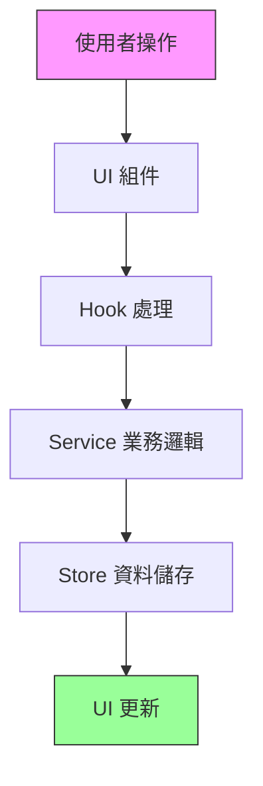

# Venturo 旅遊團管理系統

> 📌 **AI 助手使用指南**：此文檔專為 Claude 和 Claude Code 設計，提供完整的專案理解框架。

## 🎯 專案概述

**Venturo** 是一個專業的旅遊團管理系統，用於管理旅行社的日常營運，包括旅遊團管理、訂單處理、成員管理、財務追蹤等功能。

### 核心資訊
- **技術棧**：Next.js 15 + TypeScript + TailwindCSS + Zustand
- **開發狀態**：開發中（功能優先，暫不處理權限）
- **資料儲存**：目前使用前端 Store（開發階段）
- **設計風格**：莫蘭迪色系 + 液態玻璃效果

## 🏗️ 專案架構（公司組織譬喻）

把這個網站想像成一家旅行社公司：

```
Venturo 旅行社總部結構：
/Users/williamchien/Desktop/Venturo/app-ui/src/

🏢 總部大樓（src/）
├── 🏛️ 核心管理層（core/）
│   ├── 📋 制度規範（types/）     - 公司規章、表格格式
│   ├── 👔 部門經理（services/）  - 標準作業流程
│   └── ⚠️ 風控部門（errors/）   - 錯誤處理機制
│
├── 🏭 業務部門（features/）
│   └── ✈️ 旅遊團部（tours/）
│       ├── 📊 業務邏輯（services/）
│       └── 👥 業務員（hooks/）
│
├── 🏪 營業大廳（app/）
│   ├── 🎯 首頁接待（page.tsx）
│   ├── 🗺️ 旅遊團櫃台（tours/）
│   ├── 📝 訂單櫃台（orders/）
│   ├── 👥 顧客服務（customers/）
│   └── 💰 財務中心（finance/）
│
├── 🎨 裝潢設計（components/）
│   ├── 🖼️ 大廳佈置（layout/）
│   ├── 🪟 櫃台窗口（ui/）
│   └── 📋 表單模板（members/、orders/）
│
├── 🗄️ 資料倉庫（stores/）
│   ├── 📁 旅遊團檔案（tour-store.ts）
│   ├── 📁 訂單檔案（order-store.ts）
│   └── 📁 待辦事項（todo-store.ts）
│
└── 🔧 後勤支援（lib/）
    └── 🛠️ 工具箱（utils.ts）
```

## 📊 資料流程圖



### 資料流說明（用顧客服務流程比喻）
1. **顧客進門**（使用者操作）
2. **櫃台接待**（UI 組件）
3. **業務員處理**（Hook）
4. **主管審核**（Service）
5. **歸檔存檔**（Store）
6. **回覆顧客**（UI 更新）

## 🗂️ 核心資料模型

### 主要實體（Entity）
```typescript
// 這些是公司處理的主要「文件類型」
- Tour      // 旅遊團資料
- Order     // 訂單資料
- Member    // 成員資料（旅客）
- Customer  // 顧客資料
- Payment   // 付款記錄
- Quote     // 報價單
- Todo      // 待辦事項
```

### 關聯關係
```
Tour (旅遊團) 
  └── Order (訂單) [1:N]
       └── Member (成員) [1:N]
       └── Payment (付款) [1:N]
```

## 🚦 頁面路由結構

| 路徑 | 功能 | 狀態 | 說明 |
|------|------|------|------|
| `/` | 首頁總覽 | ✅ 完成 | 系統儀表板 |
| `/tours` | 旅遊團管理 | ✅ 完成 | 團體列表、新增、編輯 |
| `/tours/[id]` | 團體詳情 | 🔧 開發中 | 6 個分頁功能 |
| `/orders` | 訂單管理 | ✅ 完成 | 訂單 CRUD |
| `/customers` | 顧客管理 | ✅ 完成 | 顧客資料庫 |
| `/finance` | 財務模組 | ✅ 完成 | 4 個子模組 |
| `/quotes` | 報價系統 | ✅ 完成 | 報價單管理 |
| `/todos` | 待辦事項 | ✅ 完成 | 任務管理 |
| `/database` | 資料庫管理 | ✅ 完成 | 基礎資料維護 |

## 🏗️ 新架構改進（進行中）

### BaseService 通用服務架構
```typescript
// 位置：src/core/services/base.service.ts
// 作用：提供統一的 CRUD 操作模板
// 比喻：公司的「標準作業程序手冊」

BaseService<T>
├── create()      // 建立
├── list()        // 列表（含分頁、搜尋、過濾）
├── getById()     // 單筆查詢
├── update()      // 更新
├── delete()      // 刪除
├── batchCreate() // 批次建立
├── batchUpdate() // 批次更新
└── batchDelete() // 批次刪除
```

### 實作範例
```typescript
// TourService 繼承 BaseService
// 位置：src/features/tours/services/tour.service.ts
class TourService extends BaseService<Tour> {
  // 自動擁有所有 CRUD 功能
  // 只需加入業務特定方法
  generateTourCode()
  calculateFinancialSummary()
  updateTourStatus()
}
```

## 🎨 UI/UX 設計規範

### 莫蘭迪色系
```css
--morandi-primary: #3A3633      /* 主要文字 */
--morandi-secondary: #8B8680    /* 次要文字 */
--morandi-gold: #C4A572        /* 強調色（按鈕） */
--morandi-green: #9FA68F       /* 成功狀態 */
--morandi-red: #C08374         /* 警告狀態 */
--morandi-container: #E8E5E0   /* 容器背景 */
```

### 設計原則
1. **避免「桌面裡的桌面」** - 減少嵌套容器
2. **統一 Header 佈局** - 標題左、操作右
3. **響應式優先** - 適配所有螢幕尺寸
4. **液態玻璃效果** - 半透明背景 + 模糊

## 📝 開發指南

### 快速開始
```bash
# 1. 進入專案目錄
cd /Users/williamchien/Desktop/Venturo/app-ui

# 2. 安裝依賴
npm install

# 3. 啟動開發伺服器
npm run dev

# 4. 開啟瀏覽器
http://localhost:3000
```

### 新增功能的標準流程
```bash
# 範例：新增「供應商管理」功能

1. 定義資料模型
   └── src/stores/types.ts (加入 Supplier interface)

2. 建立 Service
   └── src/features/suppliers/services/supplier.service.ts

3. 建立 Hook  
   └── src/features/suppliers/hooks/useSuppliers.ts

4. 建立頁面
   └── src/app/suppliers/page.tsx

5. 更新導航
   └── src/components/layout/sidebar.tsx
```

## 🐛 已知問題與限制

### 技術債
1. **資料持久化** - 重新整理會遺失資料（待整合後端）
2. **ID 生成** - 使用時間戳可能碰撞（已有改進方案）
3. **權限系統** - 尚未實作（開發優先級較低）
4. **測試覆蓋** - 缺少單元測試和 E2E 測試

### 效能考量
- 大資料量時缺少虛擬滾動
- 沒有實作資料快取機制
- 圖片和資源未優化

## 🔍 AI 助手檢視指南

### 了解專案狀態
```typescript
// 1. 檢查專案結構
src/
  core/        // 查看基礎架構
  features/    // 查看功能模組
  app/         // 查看頁面路由

// 2. 關鍵檔案
- src/stores/types.ts          // 所有資料類型定義
- src/core/services/base.service.ts // 基礎服務架構
- src/app/tours/page.tsx       // 典型頁面實作範例
```

### 修改前檢查清單
- [ ] 是否遵循 BaseService 架構？
- [ ] 類型定義是否完整？
- [ ] 是否使用統一的錯誤處理？
- [ ] UI 是否符合莫蘭迪色系？
- [ ] 是否避免「桌面裡的桌面」？

### 常用命令
```bash
# 查看特定功能
find . -name "*tour*"           # 找所有旅遊團相關檔案
grep -r "BaseService" src/      # 找所有使用 BaseService 的地方

# 檢查架構
ls -la src/core/                # 核心架構
ls -la src/features/            # 功能模組
ls -la src/app/                 # 頁面路由
```

## 📚 相關文檔

| 文檔 | 位置 | 用途 |
|------|------|------|
| 技術文檔 | `/APPUI.md` | 技術架構說明 |
| 核心功能 | `/核心功能紀錄.md` | 功能實作記錄 |
| 成員管理 | `/MEMBER_MANAGEMENT.md` | 成員管理設計 |
| 開發規範 | `/CONVENTIONS.md` | 程式碼規範（建議建立） |

## 🚀 下一步計劃

### Phase 1: 完善基礎架構（當前）
- [x] BaseService 實作
- [x] TourService 範例
- [ ] 修復 ID 生成邏輯
- [ ] 完善類型定義

### Phase 2: 擴展功能模組
- [ ] OrderService
- [ ] MemberService  
- [ ] CustomerService
- [ ] PaymentService

### Phase 3: 整合後端
- [ ] API 客戶端建立
- [ ] 資料持久化
- [ ] 認證授權

### Phase 4: 優化與測試
- [ ] 效能優化
- [ ] 單元測試
- [ ] E2E 測試

## 💡 給 AI 助手的提示

當你（Claude 或 Claude Code）檢視此專案時：

1. **先了解架構** - 從 core/ 開始理解基礎設施
2. **遵循規範** - 使用 BaseService 和既定模式
3. **保持一致** - UI 使用莫蘭迪色系，架構遵循分層
4. **測試先行** - 修改前先了解影響範圍
5. **文檔同步** - 重大修改請更新此 README

## 🚨 重要設計原則：避免「桌面裡的桌面」

### ❌ 問題描述
避免過度嵌套的容器結構，這會造成：
- 視覺層次混亂
- 空間浪費
- 響應式設計問題

### ✅ 解決方案
```tsx
// ❌ 錯誤：多層容器
<div className="container">
  <div className="card">
    <div className="inner-container">
      <content />
    </div>
  </div>
</div>

// ✅ 正確：簡化結構
<div className="w-full">
  <content />
</div>
```

## 🎯 Header 佈局規範

### 統一佈局結構
```
[標題] ←——————— 空白區域 ———————→ [標籤頁] [操作按鈕]
```

### Header 組件選擇
- **`Header`**: 桌面版頁面
- **`ResponsiveHeader`**: 響應式頁面

---

**最後更新**: 2024-11-27
**維護者**: William Chien
**專案狀態**: 🚧 積極開發中